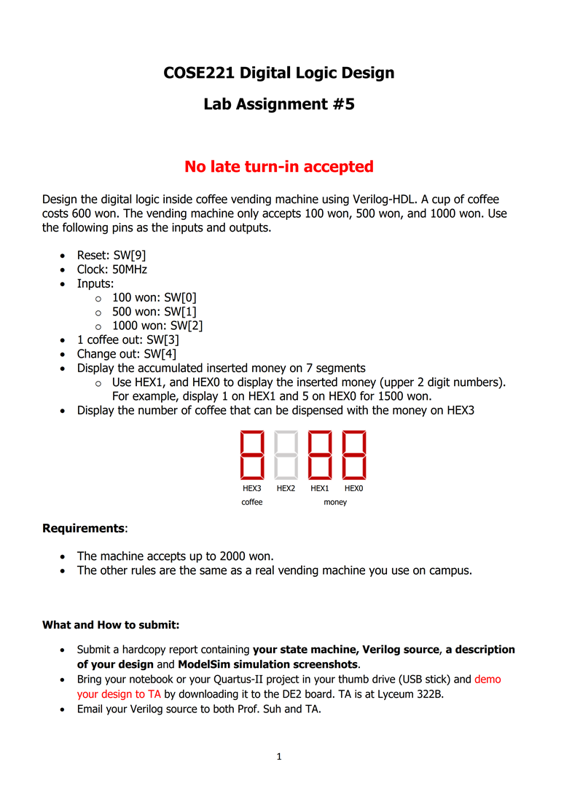
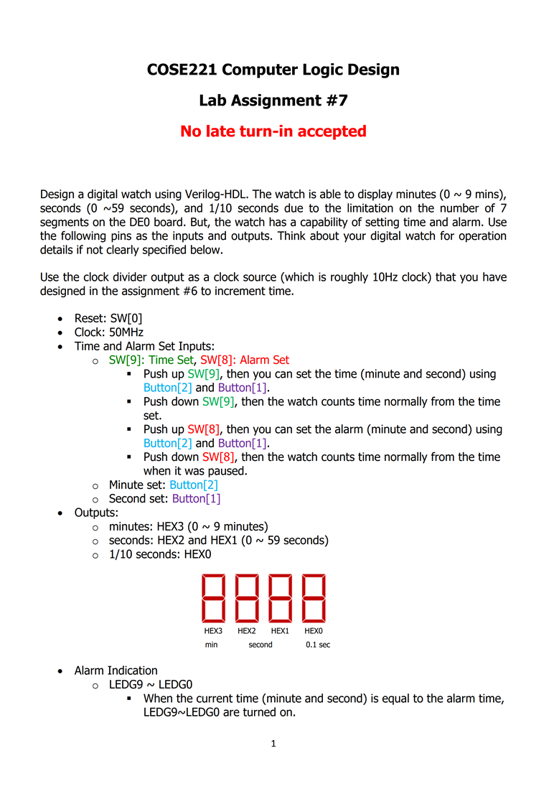

# COSE221 Digital logic design
## 환경
  * Altera DE0 board (Cyclone III EP3C16F484C6)
* QuatursII 

### Lab1

* Block design / HDL 로 XOR 회로 합성
* **완료**
### Lab2

* Pin assigment 참고하여 SW 및 7SEG 붙이기
* SW로 입력되는 BIN값을 7SEG로 display
* **완료**
### Lab3

* pusle key input 구현
* button 누를때마다 숫자 증가
* 숫자를 HEX1에 전달
* **완료**
### Lab4

* 우선순위 회로 구성
* 스위치 숫자가 작을 수 록 우선가 높음
* 복수개의 SW가 입력되어도 우선순위가 높은 스위치에 해당하는 값 출력
* **완료**
### Lab5

* 자판기 구현
* 동전 입력
  * SW[0] : 100  won
  * SW[1] : 500  won
  * SW[2] : 1000 won
* 커피 한잔 out : SW[3]
* 잔돈      out : sw[4]
* 동전은 2000원이 max
* **완료**
### Lab6

* CLK count 이용하여 0.1초마다 LED shift
* SW에 따라서 direction 바뀜
* **완료**
### Lab7

* 전자시계
* **완료**